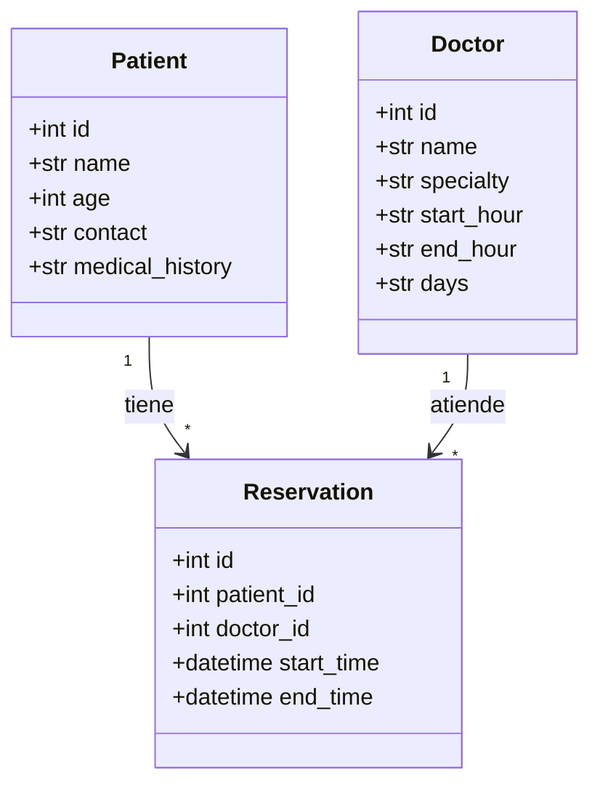

# 🏥 Sistema de Reservaciones de Consultorio Médico

## 📌 Descripción del Proyecto
El **Sistema de Reservaciones de Consultorio Médico** es una aplicación desarrollada en **Python con Flask** que permite administrar pacientes, doctores y sus reservaciones de manera eficiente.  
El sistema busca optimizar la gestión de citas médicas mediante la automatización de procesos y la validación de horarios para evitar choques en la agenda.  

Entre sus funcionalidades principales se incluyen:
- CRUD de pacientes.  
- CRUD de doctores.  
- Sistema de reservaciones.  
- Validación de choques de horarios.  
- Consulta de citas futuras y pasadas.  
- Base de datos en SQLite3 para el almacenamiento de información.  

---

## ⚙️ Instalación y Ejecución
.venv/bin/activate  # Windows: .venv\Scripts\activate
pip install -r requirements.txt
python app.py
### 1. Clonar el repositorio
```bash
git clone https://github.com/DOLOR-zaza/be-equipo2-biblioteca.git
cd Sistema de Reservaciones de Consultorio Médico-api
  
## 📊 Diagrama de Clases

